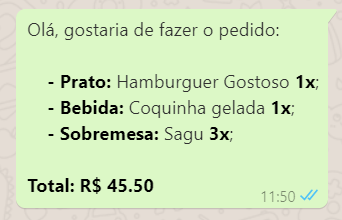

#    :stew: FoodCamp :hamburger:

> Página desenvolvida utilizando **CSS**, **HTML**, **JavaScript** e **React**. 


Acesse a página clicando **<a href="https://projeto8-react-food-camp.vercel.app/">AQUI</a>**

​																									Preview da aplicação


Após confirmar o pedido, é enviada uma mensagem para o Whatsapp da empresa, como no exemplo abaixo:




### Instruções de uso:

  1. Clone esse repositório
  2. Instale as dependências com
    ```npm i```
  3. Inicie com o comando
    ```npm start```
  4. Por fim acesse http://localhost:3000 no seu navegador preferido :)
